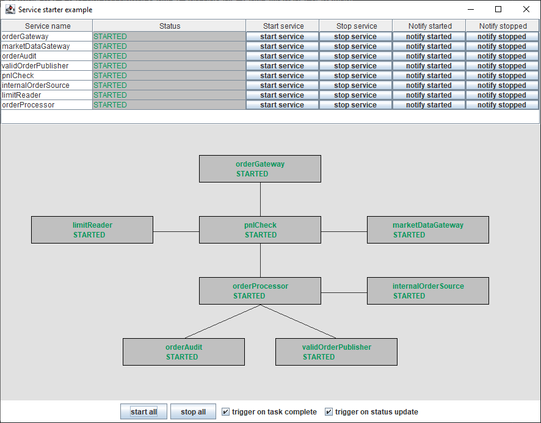

# servicestarter-example

An example demonstrating the use of [service-starter](https://github.com/gregv12/fluxtion-service-starter). 

## Running the example
Execute [Main](src/main/java/com/fluxtion/example/servicestarter/example1/Main.java) from your ide to run the example

## Overview
A simulated order processing system forms the requirements for this example. 
An order gateway connects to an exchange and process orders from market participants, 
accepting orders and not publishing them internally downstream is an unacceptable risk for the business.

The system is event driven the services downstream of the gateway must be running otherwise the gateway must be stopped. 
An internal order source submits orders that are not subject to same pnl checks as external orders. 
The internal order source is controlled independently to the order gateway, although they share some common downstream components.

The goal of this example is to control the lifecycle of the independent services:
- Start all, services start in the correct order. The order gateway must be the last component started
- Stop all, services stop in the correct order. The order gateway must be the first component stopped
- Stop/start service interactively, ensure dependencies are stopped/started in the correct order
- React to status updates of a service and start/stop required dependencies
- Start/stop a service without side effects if required

### Service gui
The example has a test gui to control services and observe ServiceManager behaviour

