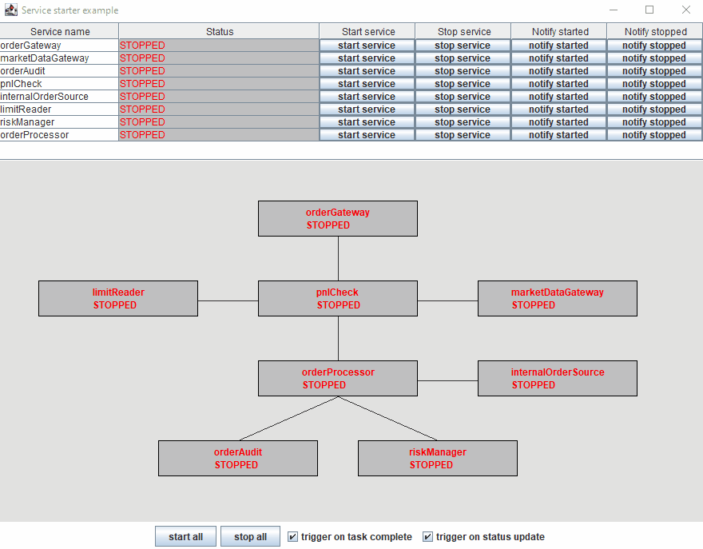

# servicestarter-example

An example demonstrating the use of [service-starter](https://github.com/gregv12/fluxtion-service-starter). 


## Running the example
Execute [Main](src/main/java/com/fluxtion/example/servicestarter/example1/Main.java) from your ide to run the example.
Use the gui to trigger start/stop. The triggering checkboxes control the automated response of ServiceManager to task 
completion and service status updates.

## Overview
A simulated order processing system forms the requirements for this example. 
An order gateway connects to an exchange and process orders from market participants. 
Orders must make it to a running instance of the risk manager, and be recorded for audit.


If the services downstream of the gateway are not running the gateway must be prevented from accepting new orders. 
An internal order source submits orders that are not subject to the same pnl checks as external orders. 
The internal order source is controlled independently to the order gateway, although they share some common downstream components.

The goal of this example is to control the lifecycle of the independent services:
- Start all services start in the correct order. The order gateway must be the last component started
- Stop all services stop in the correct order. The order gateway must be the first component stopped
- Stop/start service interactively ensure dependencies are stopped/started in the correct order
- React to status updates of a service and start/stop required dependencies
- Start/stop a service without side effects if required

### Service gui
The example has a test gui to control services and observe [ServiceManager](https://github.com/gregv12/fluxtion-service-starter/blob/v0.1.17/src/main/java/com/fluxtion/example/servicestater/ServiceManager.java)
behaviour



## Service description

The components within the system are:

| Service name        | Description                                                       | Requires started services                            |
|---------------------|-------------------------------------------------------------------|------------------------------------------------------|
| orderGateway        | Connects to exchange and receives orders                          | pnlCheck                                             |
| limitReader         | Publishes limits for valid maximum/minimum order sizes            |                                                      |
| marketDataGateway   | Publishes current market price for assets                         |                                                      |
| pnlCheck            | Validates an order is within limit size<br/>Off market rate check | limitReader<br/>marketDataGateway<br/>orderProcessor |
| orderProcessor      | Validates order details                                           | orderAudit<br/>riskManager                           |
| internalOrderSource | Order from internal customers, no pnl check required              | orderProcessor                                       |
| orderAudit          | Records all valid orders for audit                                |                                                      |
| riskManager         | Manages risk                                                      |                                                      |

[Main](src/main/java/com/fluxtion/example/servicestarter/example1/Main.java) defines the dependency relationship between
services in accordance with the table above.

## Extract demonstrating defining a service
```java
//carries out pnl check on incoming orders - has a complex dependency relationship
Service pnlCheck = Service.builder(PNL_CHECK)
        .requiredServices(limitReader, marketDataGateway)
        .servicesThatRequireMe(orderGateway)
        .stopTask(Main::emptyTask)
        .startTask(Main::emptyTask)
        .build();
//processes valid orders
Service orderProcessor = Service.builder(ORDER_PROCESSOR)
        .servicesThatRequireMe(pnlCheck)
        .stopTask(Main::emptyTask)
        .startTask(Main::emptyTask)
        .build();
```

- pnlCheck service defines services it requires: **limitReader, marketDataGateway** and also services that 
require it: **orderGateway**.
- orderProcessor service defines service that require it: **pnlCheck**
-  The start and stop tasks always succeed after a timed delay of 1_500 milliseconds.

## Building the ServiceManager
Once all the services are defined the service manager can be built:
```java
ServiceManager svcManager = ServiceManager.build(
        orderGateway,
        limitReader,
        marketDataGateway,
        pnlCheck,
        orderProcessor,
        internalOrderSource,
        orderAudit,
        riskManager
);
```

## Threading model
All the requests take place on the gui thread and by default the task would execute on this thread as well. The task sleeps
for 1_500 milliseconds which would lock the gui. The ServiceManager is configured to execute with an [AsynchronousTaskExecutor](https://github.com/gregv12/fluxtion-service-starter/blob/v0.1.17/src/main/java/com/fluxtion/example/servicestater/helpers/AsynchronousTaskExecutor.java)
that runs tasks on worker threads and ensures the gui is not locked during task execution. 

```java
svcManager.registerTaskExecutor(new AsynchronousTaskExecutor());
```

Notifications from the tasks to the ServiceManager are on worker thread. As the ServiceManager is thread safe there is 
no race with the gui thread updating the ServiceManager at the same time.

## Automatic triggering on successful task execution

When a service is started or stopped then dependency tasks are executed as required. When a task completes without 
exception then the status for the service is updated and the next set of tasks are executed.

```java
svcManager.triggerNotificationOnSuccessfulTaskExecution(true);
```

It is possible to disable this behaviour by changing the flag to false so that after an execution there is no 
automatic status update and triggering of sub-tasks. This allows the developer to effectively debug the events passing 
into the service manager. Use the notification buttons to progress the execution

The checkbox on the gui is connected to relevant flags.

## Automatic task triggering on state changes

When a notification of a service status change to started or stopped ir received then dependency tasks are executed as
required. This triggers a cascade of tasks

```java
svcManager.triggerDependentsOnNotification(true);
```

It is possible to disable this behaviour by changing the flag to false so that a status update will not trigger of
sub-tasks.

The checkbox on the gui is connected to relevant flags.

## Registering the gui as a status listener

```java
svcManager.registerStatusListener(new ServiceManagaerFrame(svcManager)::logStatus);
```