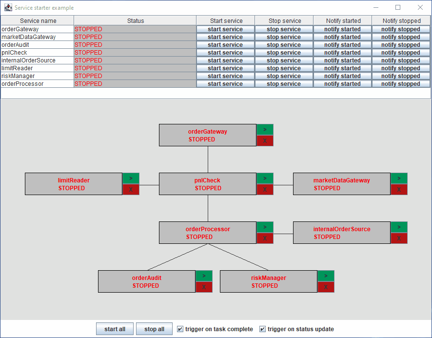
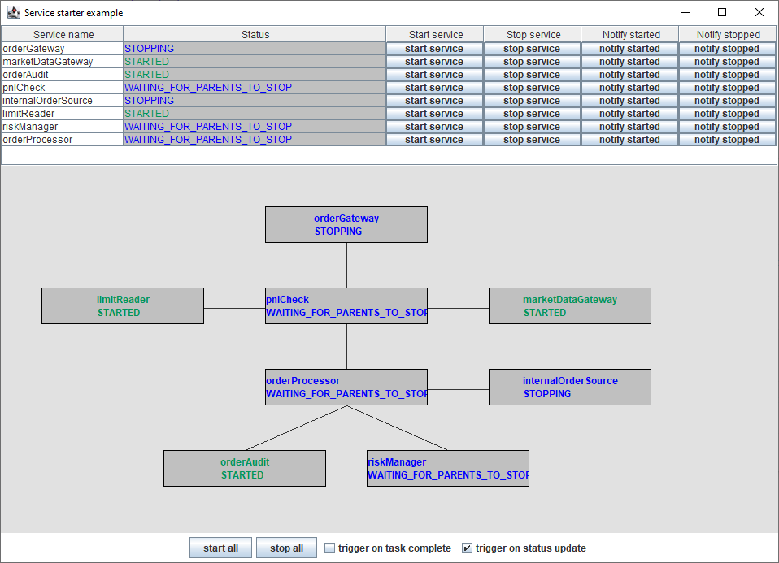
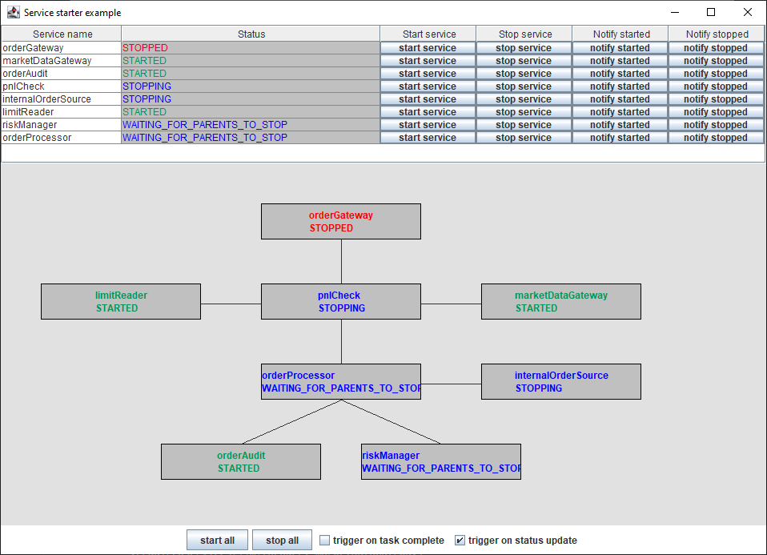
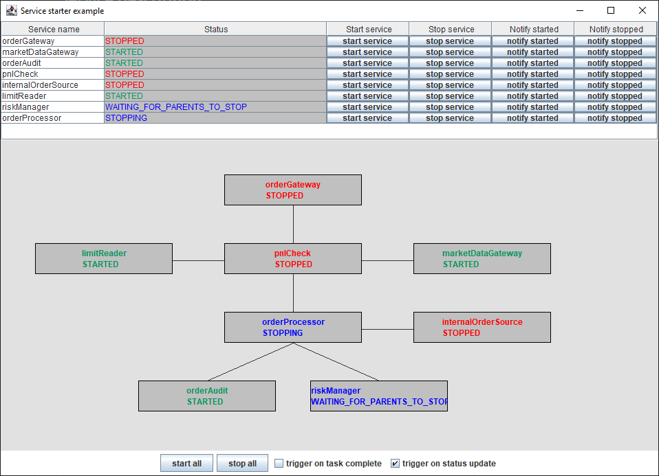
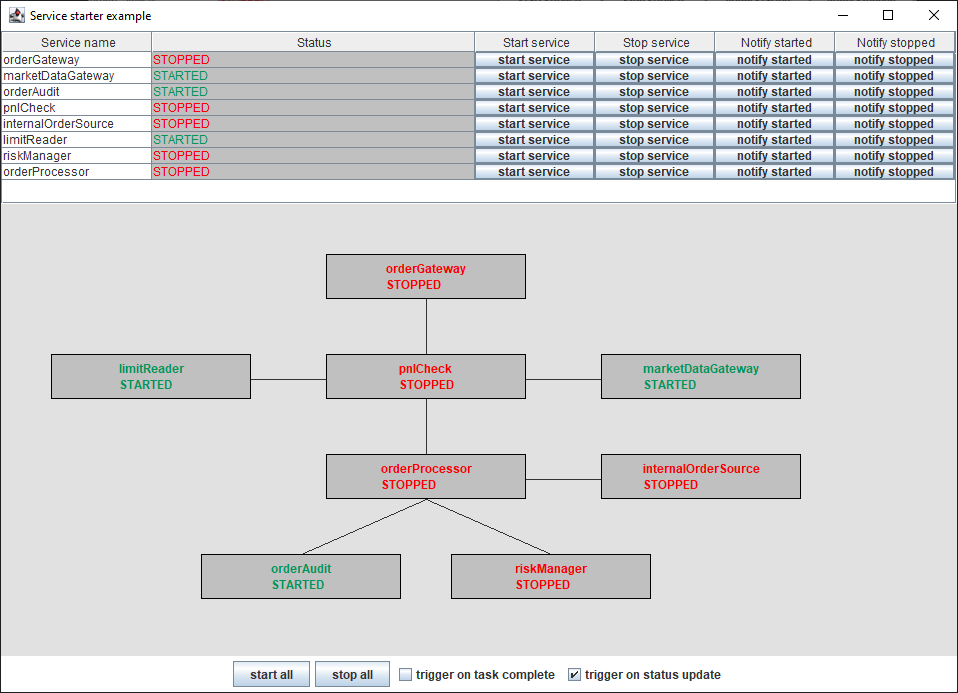

# servicestarter-example

An example demonstrating the use of [service-starter](https://github.com/gregv12/fluxtion-service-starter)  The purpose 
of ServiceStarter is to control the lifecycle of independent services, ensuring that services start and stop in the 
correct order and predictably degrade if a required service fails at runtime. This tutorial is based upon a notional 
order processing system connected to an exchange.

## Running the example
Run the [executable jar](dist/servicestarter-orderprocessing-example.jar) in the dist directory:

```
java -jar .\dist\servicestarter-orderprocessing-example.jar
```

Use the gui to trigger start/stop of services. The triggering checkboxes control the automated response of 
ServiceManager to task completion and service status updates.

Clone the project and execute [Main](src/main/java/com/fluxtion/example/servicestarter/example1/Main.java) from your ide 
to run the example.

## Overview
A simulated order processing system forms the requirements for this example. 
An order gateway connects to an exchange and process orders from market participants. 
Orders must make it to a running instance of the risk manager and the order audit recorder.

The goal of this example is to control the lifecycle of the independent services:
- Start all services start in the correct order. The order gateway must be the last component started
- Stop all services stop in the correct order. The order gateway must be the first component stopped
- Stop/start service interactively ensure dependencies are stopped/started in the correct order
- React to status updates of a service and start/stop required dependencies
- Start/stop a service without side effects if required

The services themselves are dummies and have no functionality, they just represent a notional service.

If the services downstream of the gateway are not running the gateway must be prevented from accepting new orders. 
An internal order source submits orders that are not subject to the same pnl checks as external orders. 
The internal order source is controlled independently to the order gateway, although they share some common downstream components.


## Service gui
The example has a test gui to control services and observe [ServiceManager](https://github.com/gregv12/fluxtion-service-starter/blob/v0.1.17/src/main/java/com/fluxtion/example/servicestater/ServiceManager.java)
behaviour



## Service description

Services within the system are:

| Service name        | Description                                                       | Requires started services                            |
|---------------------|-------------------------------------------------------------------|------------------------------------------------------|
| orderGateway        | Connects to exchange and receives orders                          | pnlCheck                                             |
| limitReader         | Publishes limits for valid maximum/minimum order sizes            |                                                      |
| marketDataGateway   | Publishes current market price for assets                         |                                                      |
| pnlCheck            | Validates an order is within limit size<br/>Off market rate check | limitReader<br/>marketDataGateway<br/>orderProcessor |
| orderProcessor      | Validates order details                                           | orderAudit<br/>riskManager                           |
| internalOrderSource | Order from internal customers, no pnl check required              | orderProcessor                                       |
| orderAudit          | Records all valid orders for audit                                |                                                      |
| riskManager         | Manages risk                                                      |                                                      |

# Programming the example

[Main](src/main/java/com/fluxtion/example/servicestarter/example1/Main.java) defines the dependency relationship between
services in accordance with the table above and builds a [ServiceManager](https://github.com/gregv12/fluxtion-service-starter/blob/v0.1.17/src/main/java/com/fluxtion/example/servicestater/ServiceManager.java) 
that will [control the services](https://gregv12.github.io/fluxtion-service-starter/controllingServices.html).
The gui is a sample built for this tutorial and is not general purpose. The gui registers as a status update listener 
and invokes methods on the ServiceManager.

## Defining a service
Service definitions map an external service, start task, stop task and dependencies into the ServiceManager,  
see [here for documentation](https://gregv12.github.io/fluxtion-service-starter/buildingServiceManager.html#service) 
describing a service. A builder pattern is used to construct service definitions.

### Extract demonstrating defining a service
```java
//carries out pnl check on incoming orders - has a complex dependency relationship
Service pnlCheck = Service.builder(PNL_CHECK)
        .requiredServices(limitReader, marketDataGateway)
        .servicesThatRequireMe(orderGateway)
        .stopTask(Main::emptyTask)
        .startTask(Main::emptyTask)
        .build();
//processes valid orders
Service orderProcessor = Service.builder(ORDER_PROCESSOR)
        .servicesThatRequireMe(pnlCheck)
        .stopTask(Main::emptyTask)
        .startTask(Main::emptyTask)
        .build();
```

The code above creates service defintions:

- Each service is provided with a unique name
- pnlCheck service defines services it requires: limitReader, marketDataGateway
- pnlCheck defines services that require it: orderGateway.
- orderProcessor service defines service that require it: pnlCheck
- The start and stop tasks are set to ```Main::emptyTask``` for all services

```Main::emptyTask``` always succeed after a timed delay of 1_500 milliseconds.

## Building the ServiceManager
Once all the services are defined the ServiceManager can be built with the list of services. A ServiceManager is the 
controller for managing services and publishing the set of tasks to execute in response to a service event.  
See here for information about [building a ServiceManager](https://gregv12.github.io/fluxtion-service-starter/buildingServiceManager.html)
and here for how [services are controlled](https://gregv12.github.io/fluxtion-service-starter/controllingServices.html).
```java
ServiceManager svcManager = ServiceManager.build(
        orderGateway,
        limitReader,
        marketDataGateway,
        pnlCheck,
        orderProcessor,
        internalOrderSource,
        orderAudit,
        riskManager
);
```

## Threading model
All the requests take place on the gui thread and default behaviour is to execute the task on the calling thread. 
The example task sleeps for 1_500 milliseconds which would lock the gui. For this example the ServiceManager 
is configured to execute tasks with an [AsynchronousTaskExecutor](https://github.com/gregv12/fluxtion-service-starter/blob/v0.1.17/src/main/java/com/fluxtion/example/servicestater/helpers/AsynchronousTaskExecutor.java)
. Tasks run on worker threads and ensures the gui is not locked during task execution.

The tasks published by the ServiceManager are independent and can safely be executed in parallel by worker threads 
created by the  AsynchronousTaskExecutor. The default [SynchronousTaskExecutor](https://github.com/gregv12/fluxtion-service-starter/blob/v0.1.17/src/main/java/com/fluxtion/example/servicestater/helpers/SynchronousTaskExecutor.java) 
does not parallelise execution of tasks they run serially. 

```java
svcManager.registerTaskExecutor(new AsynchronousTaskExecutor());
```

Notifications from the tasks to the ServiceManager are on a worker thread. As the ServiceManager is thread safe there is 
no race condition with the gui thread trying to update the ServiceManager at the same time.

## Automatic triggering on successful task execution

When a service is started or stopped tasks are executed as specified in the service defintion. If a task completes 
without exception then the status for the service is updated to either STOPPED or STARTED. Change of service state 
triggers the ServiceManager to generated the next set of tasks to execute.

```java
svcManager.triggerNotificationOnSuccessfulTaskExecution(true);
```

It is possible to disable this behaviour by changing the flag to false so that after an execution there is no 
automatic status update and triggering of sub-tasks. This allows the developer to effectively debug the events passing 
into the service manager. Use the notification buttons to progress the execution

The checkbox on the gui is connected to relevant flags in ServiceManager.

## Automatic task triggering on state changes

Sometimes services unexpectedly start or stop, dependent services should be controlled to maintain the integrity of the 
system. If a service monitoring solution is in place notifications can be sent to the ServiceManager via [api calls](https://github.com/gregv12/fluxtion-service-starter/blob/64f7ed6fbaa07a7407f14f1c72983fa6ed15b287/src/main/java/com/fluxtion/example/servicestater/ServiceManager.java#L92). 
When the ServiceManager receives a notification of a service status change then tasks are executed as required to 
control the starting and stopping of dependent services.

It is possible to disable this behaviour by changing the triggerDependentsOnNotification flag to false so that a 
status update will not trigger execution of sub-tasks.

```java
svcManager.triggerDependentsOnNotification(true);
```

The checkbox on the gui is connected to relevant flags in ServiceManager.

## Registering the gui as a status listener
When a service state changes the ServiceManager publishes a list of all service [ServiceStatusRecord's](https://github.com/gregv12/fluxtion-service-starter/blob/master/src/main/java/com/fluxtion/example/servicestater/ServiceStatusRecord.java) 
to a registered listener. The gui registers for status updates with:

```java
svcManager.registerStatusListener(new ServiceManagaerFrame(svcManager)::logStatus);
```

When the gui is notified with a status update the screen is repainted reflecting the new state of the services 
according to the ServiceManager

## Service states
Each service is effectively a state machine transitioning to a new state in response to events posted by the 
ServiceManager. The state definitions for a service are [described here](https://gregv12.github.io/fluxtion-service-starter/controllingServices.html#service-states).

# Stopping the riskManager
Ensure all service are running, un-tick "trigger on task complete" checkbox then stop the risk manager. Un-ticking
"trigger on task complete" allows the developer to step through the states by manually using notify started buttons.

### Push stop service for the riskManager
| Service name        | Status                      | Stop task executing | Stop task completed |
|---------------------|-----------------------------|---------------------|---------------------|
| orderGateway        | STOPPING                    | yes                 |                     |
| limitReader         | STARTED                     |                     |                     |
| marketDataGateway   | STARTED                     |                     |                     |
| pnlCheck            | WAITING_FOR_PARENTS_TO_STOP |                     |                     |
| orderProcessor      | WAITING_FOR_PARENTS_TO_STOP |                     |                     |
| internalOrderSource | STOPPING                    | yes                 |                     |
| orderAudit          | STARTED                     |                     |                     |
| riskManager         | WAITING_FOR_PARENTS_TO_STOP |                     |                     |



### Push notify stopped for orderGateway
| Service name        | Status                      | Stop task executing | Stop task completed |
|---------------------|-----------------------------|---------------------|---------------------|
| orderGateway        | STOPPED                     |                     | yes                 |
| limitReader         | STARTED                     |                     |                     |
| marketDataGateway   | STARTED                     |                     |                     |
| pnlCheck            | STOPPING                    | yes                 |                     |
| orderProcessor      | WAITING_FOR_PARENTS_TO_STOP |                     |                     |
| internalOrderSource | STOPPING                    | yes                 |                     |
| orderAudit          | STARTED                     |                     |                     |
| riskManager         | WAITING_FOR_PARENTS_TO_STOP |                     |                     |




### Push notify stopped for internalOrderSource and pnlCheck
| Service name        | Status                      | Stop task executing | Stop task completed |
|---------------------|-----------------------------|---------------------|---------------------|
| orderGateway        | STOPPED                     |                     | yes                 |
| limitReader         | STARTED                     |                     |                     |
| marketDataGateway   | STARTED                     |                     |                     |
| pnlCheck            | STOPPED                     |                     | yes                 |
| orderProcessor      | STOPPING                    | yes                 |                     |
| internalOrderSource | STOPPED                     |                     | yes                 |
| orderAudit          | STARTED                     |                     |                     |
| riskManager         | WAITING_FOR_PARENTS_TO_STOP |                     |                     |




### Push notify stopped for orderProcessor and riskManager
| Service name        | Status   | Stop task executing | Stop task completed |
|---------------------|----------|---------------------|---------------------|
| orderGateway        | STOPPED  |                     | yes                 |
| limitReader         | STARTED  |                     |                     |
| marketDataGateway   | STARTED  |                     |                     |
| pnlCheck            | STOPPED  |                     | yes                 |
| orderProcessor      | STOPPED  |                     | yes                 |
| internalOrderSource | STOPPED  |                     | yes                 |
| orderAudit          | STARTED  |                     |                     |
| riskManager         | STOPPED  |                     | yes                 |


